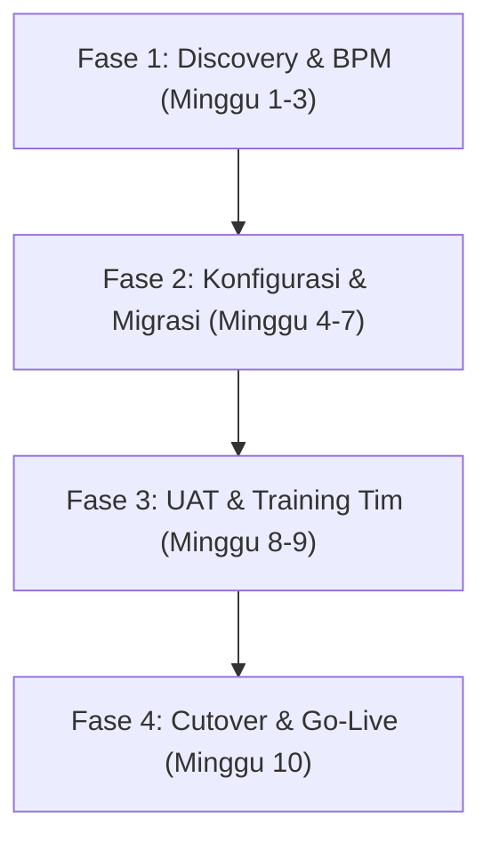

Implementasi sistem *Enterprise Resource Planning* (ERP) sering kali dianggap momok menakutkan oleh banyak pelaku usaha. Survei industri global mencatat bahwa lebih dari 60% proyek ERP konvensional mengalami keterlambatan jadwal atau melebihi anggaran (*cost overrun*). 

Penyebab utamanya bukan kelemahan software, melainkan **kesalahan metodologi eksekusi, pemetaan alur kerja yang tidak tuntas, dan ketiadaan manajemen perubahan (*change management*)**.

Panduan ini merangkum metodologi teruji implementasi **ERPNext** untuk memastikan transisi sistem bisnis Anda berjalan lancar, aman, dan tepat waktu.

---

## 1. Fondasi Arsitektur Teknologi ERPNext

ERPNext dibangun di atas **Frappe Framework**, sebuah kerangka kerja aplikasi web *full-stack* berbasis Python dan JavaScript yang mengedepankan prinsip *meta-data driven architecture*.

```text
┌─────────────────────────────────────────────────────────────┐
│                 Web / Mobile UI (Desk UI)                   │
├─────────────────────────────────────────────────────────────┤
│         API Layer (RESTful & RPC / Socket.io Realtime)      │
├─────────────────────────────────────────────────────────────┤
│     Frappe Application Engine (DocType, Hooks, Workflows)   │
├──────────────────────────────┬──────────────────────────────┤
│  In-Memory Caching & Queue   │   Relational Storage Engine  │
│      (Redis Sentinel)        │      (MariaDB / PostgreSQL)  │
└──────────────────────────────┴──────────────────────────────┘
```

### Keunggulan Struktural bagi Bisnis:
1. **Model Data Modular (DocType):** Menghubungkan modul Keuangan (*Accounts*), Pembelian (*Buying*), Penjualan (*Selling*), Gudang (*Stock*), dan SDM (*HR*) ke dalam satu buku besar (*single source of truth*).
2. **Kustomisasi Tanpa Mengubah Core Engine:** Setiap formulir baru atau logika validasi disimpan sebagai konfigurasi terisolasi, memudahkan proses *upgrade* versi sistem di masa mendatang tanpa merusak alur yang sudah berjalan.

---

## 2. Empat Fase Eksekusi Implementasi Terstruktur



### Fase 1: Discovery & Business Process Mapping (Minggu 1–3)
- **Dokumentasi SOP Berjalan:** Petakan rantai operasional dari penawaran harga (*Quotation*), pesanan penjualan (*Sales Order*), pengiriman barang (*Delivery Note*), hingga penerbitan faktur (*Sales Invoice*).
- **Audit Data Master (*Data Cleansing*):** Standarisasi penamaan master data pelanggan, pemasok, daftar kode barang (*SKU*), dan struktur kode akun (*Chart of Accounts*).

### Fase 2: Konfigurasi Sistem & Lokalisasi (Minggu 4–7)
- **Penyiapan Akuntansi & Pajak:** Penyesuaian mata uang (IDR), format nomor faktur pajak, dan formula perhitungan PPh 21 / BPJS.
- **Automasi Server Script:** Menambahkan aturan validasi bisnis otomatis menggunakan *Server Script* Frappe:

```python
# Contoh: Validasi Otomatis Batas Kredit Pelanggan sebelum Submit Sales Order
customer = frappe.get_doc("Customer", doc.customer)
credit_limit = customer.custom_credit_limit or 0

if credit_limit > 0 and (customer.outstanding_amount + doc.grand_total) > credit_limit:
    frappe.throw(
        f"Transaksi ditolak: Total tagihan melebihi batas kredit yang disetujui (Maks: Rp {credit_limit:,.0f})"
    )
```

### Fase 3: User Acceptance Testing (UAT) & Pelatihan Departemen (Minggu 8–9)
Pelatihan dilakukan berdasarkan simulasi studi kasus nyata per divisi:

| Divisi Kerja | Fokus Modul ERPNext | Target Kompetensi |
|---|---|---|
| **Finance & Accounting** | Accounts, General Ledger, Tax, Payment | Mampu tutup buku bulanan & rekonsiliasi bank otomatis |
| **Procurement & Warehouse** | Buying, Stock Ledger, Stock Entry | Kontrol stok multi-gudang real-time & FIFO valuation |
| **Sales & Commercial** | CRM, Quotation, Sales Order | Pelacakan pipeline prospek dan verifikasi batas kredit |
| **HR & General Affairs** | Employee, Leave, Payroll, Expense Claim | Otomatisasi penggajian massal & slip gaji digital |

### Fase 4: Cutover, Go-Live & Masa Pendampingan (Hypercare)
- **Cutover Saldo Awal:** Input saldo neraca awal, nilai persediaan fisik (*Stock Reconciliation*), dan saldo piutang/utang berjalan.
- **Parallel Runing (Opsional 1–2 Minggu):** Menjalankan pencatatan ganda pada siklus krusial untuk memastikan tidak ada selisih data.
- **Hypercare 30 Hari:** Pendampingan teknis intensif di lokasi untuk membantu adaptasi staf operasional.

---

## 3. Matriks Manajemen Risiko Implementasi

| Potensi Kendala | Tingkat Dampak | Strategi Mitigasi Terbukti |
|---|---|---|
| **Resistensi Karyawan** | Tinggi | Libatkan perwakilan staf operasional sejak tahap pengujian formulir (UAT). |
| **Data Master Kotor / Duplikat** | Kritis | Wajibkan validasi dan pembersihan data sebelum proses impor database (*Data Import Tool*). |
| **Kustomisasi Berlebihan** | Sedang | Utamakan 80% fitur standar (*out-of-the-box*) dan kustomisasi hanya untuk alur inti bisnis. |

---

## 4. Kesimpulan

Implementasi ERP bukan sekadar proyek pemasangan aplikasi komputer, melainkan **transformasi disiplin operasional perusahaan**. Dengan memilih ERPNext yang bebas lisensi dan menerapkan metodologi implementasi bertahap, perusahaan Anda dapat mencapai transparansi data bisnis secara presisi tanpa pemborosan anggaran.

---

> 🚀 **Ingin Memulai Transformasi Digital dengan Aman?** Diskusikan cetak biru implementasi ERPNext bersama tim konsultan kami di [Halaman Kontak Samkarsa](/#kontak).
