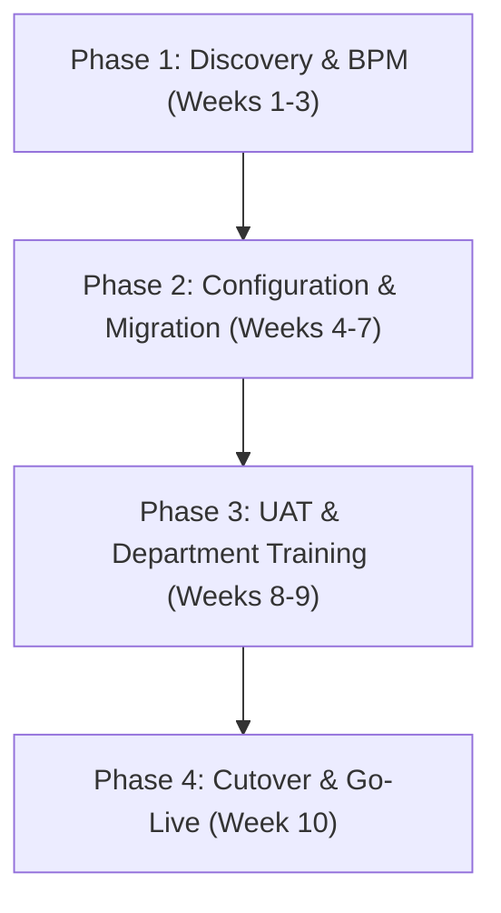

Enterprise Resource Planning (ERP) rollouts are notorious for schedule delays and cost overruns. Global industry surveys report that over 60% of traditional ERP initiatives exceed original budgets.

The primary culprit is rarely software deficiency, but rather **inadequate process mapping, unvalidated legacy data migration, and missing change management frameworks**.

This guide outlines a proven methodology for deploying **ERPNext** to achieve an efficient, on-time, and risk-mitigated go-live.

---

## 1. Technical Architecture of ERPNext

ERPNext is built on the **Frappe Framework**, a modern full-stack Python/JavaScript engine designed around *metadata-driven architecture*.

```text
┌─────────────────────────────────────────────────────────────┐
│                 Web / Mobile UI (Desk UI)                   │
├─────────────────────────────────────────────────────────────┤
│         API Layer (RESTful & RPC / Socket.io Realtime)      │
├─────────────────────────────────────────────────────────────┤
│     Frappe Application Engine (DocType, Hooks, Workflows)   │
├──────────────────────────────┬──────────────────────────────┤
│  In-Memory Caching & Queue   │   Relational Storage Engine  │
│      (Redis Sentinel)        │      (MariaDB / PostgreSQL)  │
└──────────────────────────────┴──────────────────────────────┘
```

### Architectural Strengths:
1. **Unified Relational Data Model (DocType):** Unifies Accounting (*Accounts*), Purchasing (*Buying*), Sales (*Selling*), Inventory (*Stock*), and HR into a single source of truth.
2. **Non-Invasive Customization:** Custom fields, scripts, and workflows remain isolated from core files, enabling effortless upstream version upgrades without regressions.

---

## 2. Four-Phase Structured Implementation Framework



### Phase 1: Discovery & Business Process Mapping (Weeks 1–3)
- **Workflow Documentation:** Map end-to-end commercial cycles: Quotation ➔ Sales Order ➔ Delivery Note ➔ Sales Invoice.
- **Master Data Cleansing:** Standardize customer registries, vendor master records, item SKUs, and Chart of Accounts (COA).

### Phase 2: System Configuration & Localization (Weeks 4–7)
- **Accounting & Fiscal Setup:** Currency (IDR), tax numbering formats, and automated PPh 21 / BPJS salary structures.
- **Server Scripting Automations:** Implement automated business guardrails via Frappe Server Scripts:

```python
# Example: Automatic Credit Limit Enforcement before Sales Order Submission
customer = frappe.get_doc("Customer", doc.customer)
credit_limit = customer.custom_credit_limit or 0

if credit_limit > 0 and (customer.outstanding_amount + doc.grand_total) > credit_limit:
    frappe.throw(
        f"Order Rejected: Total exposure exceeds approved credit limit (Limit: IDR {credit_limit:,.0f})"
    )
```

### Phase 3: User Acceptance Testing (UAT) & Department Training (Weeks 8–9)
Departmental training conducted with real transactional scenarios:

| Department | Module Focus | Core Competency |
|---|---|---|
| **Finance & Accounting** | Accounts, General Ledger, Tax, Payment | Automated bank reconciliation and monthly book closing |
| **Procurement & Warehouse** | Buying, Stock Ledger, Stock Entry | Real-time multi-warehouse inventory & FIFO valuation |
| **Sales & Commercial** | CRM, Quotation, Sales Order | Pipeline tracking and automated credit verification |
| **HR & Operations** | Employee, Leave, Payroll, Expense Claim | Bulk payroll execution and digital pay slips |

### Phase 4: Cutover, Go-Live & 30-Day Hypercare
- **Opening Balances Migration:** Cutover trial balances, verified stock counts (*Stock Reconciliation*), and active AR/AP aging records.
- **Parallel Run (Optional 1–2 Weeks):** Dual recording on critical workflows to eliminate data discrepancies.
- **30-Day Hypercare Support:** Dedicated technical oversight to guide internal teams during the initial billing cycles.

---

## 3. Summary & Next Steps

An ERP rollout is fundamentally an **operational discipline upgrade**. By choosing license-free ERPNext and adopting a phased, risk-controlled methodology, your business secures complete operational transparency and scalable infrastructure.

---

> 🚀 **Ready to streamline your enterprise operations?** Schedule an architectural discovery session with our engineers at [Samkarsa Contact](/en/#kontak).
